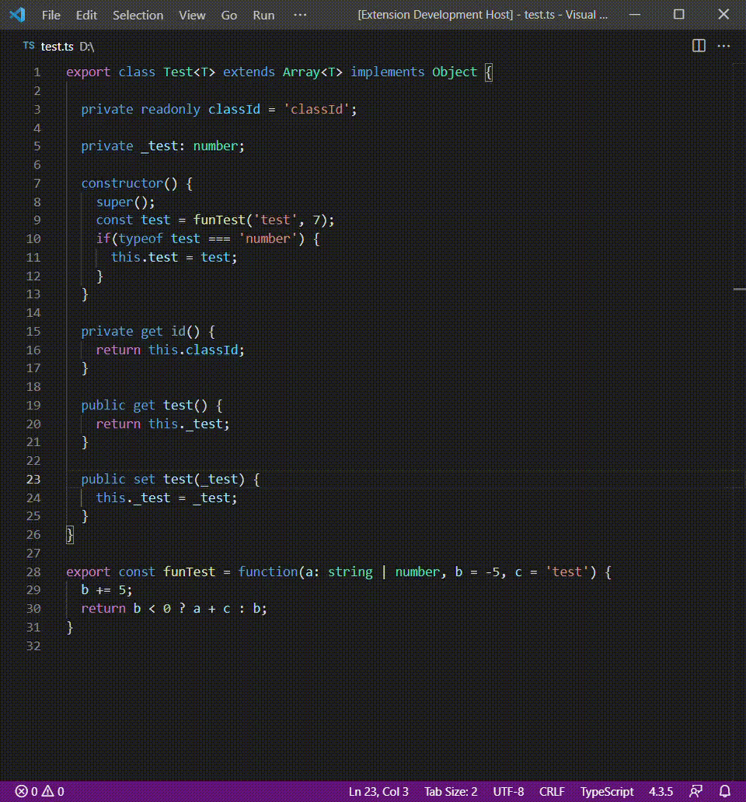
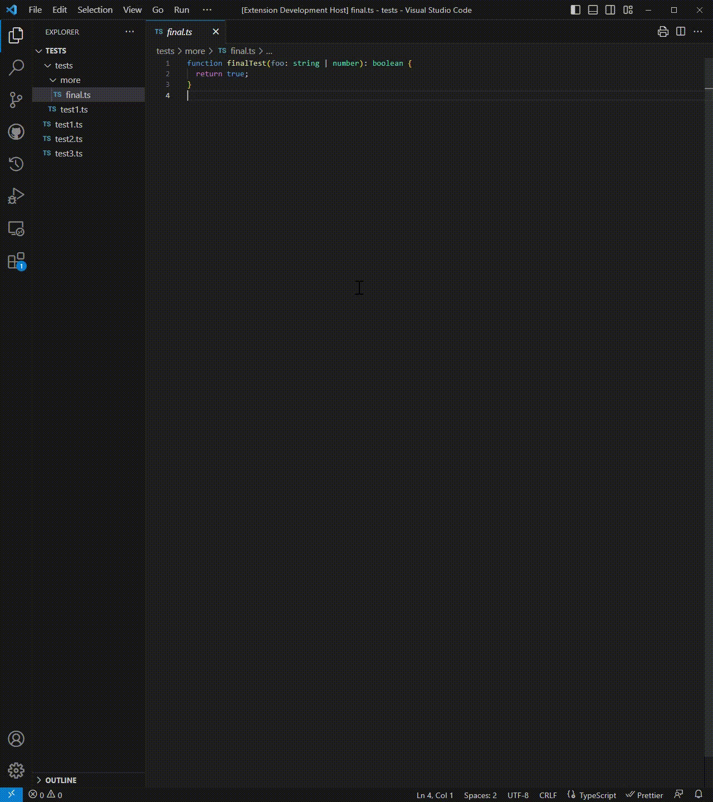
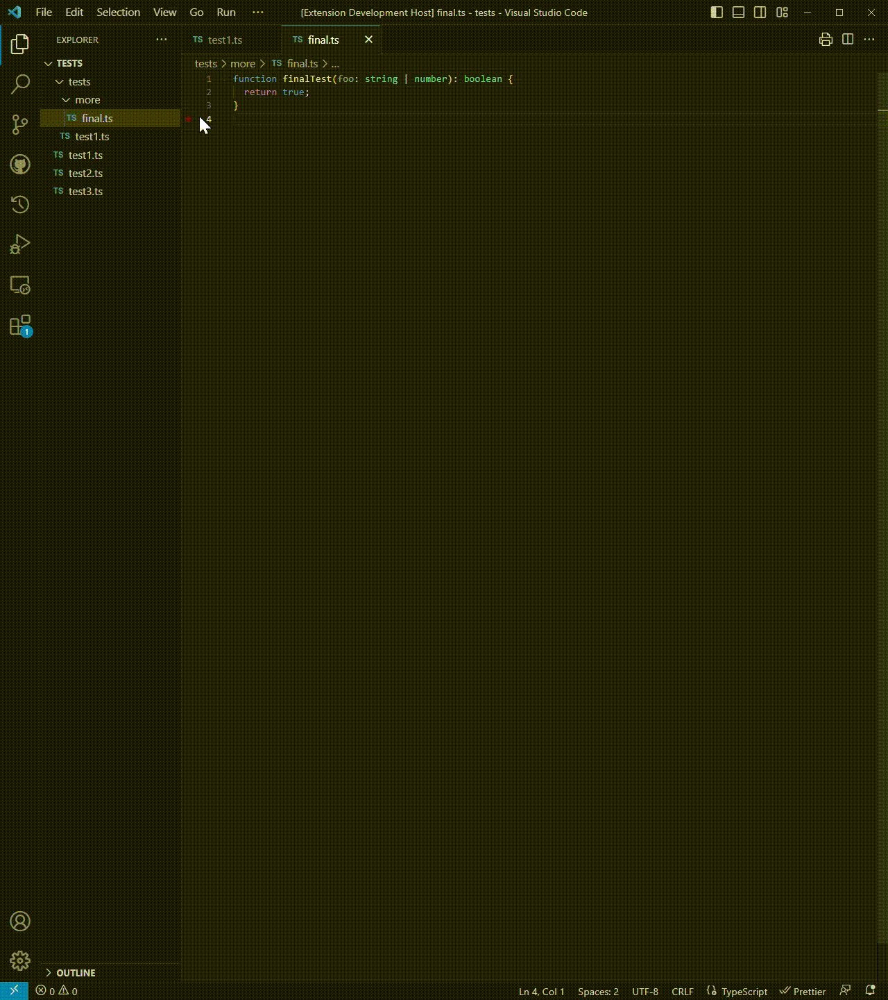

# JSDoc Generator - README

Automatic JSDoc generator for JavaScript, TypeScript and Typescript/JavaScript React.

---

## Features

Generates specific JSDoc for any supported TypeScript/JavaScript node.

It can be generated for a single node by explicitly calling the command `Generate JSDoc` or by using auto-completion:  


Can also be generated for all supported TypeScript nodes in a single file that do not already have a JSDoc by calling the command `Generate JSDoc for the current file` either via the command menu or by right clicking in the explorer view:  


It's possible to generate JSDocs for all supported TypeScript nodes in the whole workspace by calling the command `Generate JSDoc for the workspace`:  


If the whole workspace is too much, it's also possible to generate JSDocs for a single folder (recursive) by clicking on `Generate JSDoc in Folder` in the Explorer view contextual menu:  


## Extension Settings

This extension contributes the following settings:

- `jsdoc-generator.descriptionPlaceholder`:  
  Set the description placeholder. Empty to disable.  
  Default: `"Description placeholder"`
- `jsdoc-generator.author`:  
  Set the value for the author tag.  
  Empty to disable, set to "author" to insert "author" as placeholder.  
  Default: `""`
- `jsdoc-generator.dateFormat`:  
  Fill in with any valid [MomentJs format](https://momentjs.com/) (either explicit or locale) to include the date tag.  
  Formats can include time as well.  
  Leave empty to disable.  
  Default: `""`
- `jsdoc-generator.emptyLineAfterHeader`:  
  Whether to prefer single line comments (`/** ... */`) whenever possible.  
  Default: `true`
- `jsdoc-generator.singleLineComments`:  
  Whether to add an empty line after the header (description, date, author).  
  Default: `false`
- `jsdoc-generator.includeTypes`:  
  Whether to include types into the generated JSDoc.  
  Default: `true`
- `jsdoc-generator.includeParenthesisForMultipleTypes`:  
  When enabled, will include round brackets around union and intersection types.  
  Note that round brackets will still be used if manually put in the type or for union and intersection types which are also optional or mandatory.  
  Default: `true`
- `jsdoc-generator.descriptionForConstructors`:  
  "{Object}" will be replaced with the class name.  
  For default exported classes without a name `jsdoc-generator.descriptionPlaceholder` will be used instead.  
  Empty to disable.  
  Default: `"Creates an instance of {Object}."`
- `jsdoc-generator.functionVariablesAsFunctions`:  
  When enabled, will document variables with a function assigned as function declarations.  
  Disable to document like properties.  
  Default: `true`
- `jsdoc-generator.includeExport`:  
  When enabled, will include the export tag.  
  Disable to exclude it from the generated JSDoc.  
  Default: `true`
- `jsdoc-generator.includeAsync`:  
  When enabled, will include the async tag.  
  Disable to exclude it from the generated JSDoc.  
  Default: `true`
- `jsdoc-generator.customTags`:  
  When configured, will add the specified custom tags.  
  For example this:
  ```json
  "jsdoc-generator.customTags": [
    {
      "tag": "example",
      "placeholder": "Example placeholder."
    },
  ]
  ```
  Will result in:
  ```typescript
  /**
   * Description placeholder.
   *
   * @param {number} n
   * @example Example placeholder.
   * @returns {string}
   */
  function foo(n: number): string {
    return `${n}`;
  }
  ```
- `jsdoc-generator.tagValueColumnStart`:  
  Starting point of the column containing the tag value (if any, e.g. type).  
  0 to make it adaptive (default, no alignment), a positive number to fix the starting point.  
  Note that if the tag previous values take over the specified starting point, the column will be shifted.  
  It can be combined with the other `ColumnStart` settings.  
  For example, a value of 10 results in:
  ```typescript
  /**
   * AI generated function description.
   * @author Crystal Spider
   *
   * @param    {number} num AI generated parameter description.
   * @param    {boolean} bool AI generated parameter description.
   * @returns  {string} AI generated return description.
   */
  function foo(num: number, bool: number): string {
    return `${num}-${bool}`;
  }
  ```
- `jsdoc-generator.tagNameColumnStart`:  
  Starting point of the column containing the tag name value (if any, e.g. parameter name).  
  0 to make it adaptive (default, no alignment), a positive number to fix the starting point.  
  Note that if the tag previous values take over the specified starting point, the column will be shifted.  
  It can be combined with the other `ColumnStart` settings.  
  For example, a value of 20 results in:
  ```typescript
  /**
   * AI generated function description.
   * @author Crystal Spider
   *
   * @param {number}     num AI generated parameter description.
   * @param {boolean}    bool AI generated parameter description.
   * @returns {string} AI generated return description.
   */
  function foo(num: number, bool: number): string {
    return `${num}-${bool}`;
  }
  ```
- `jsdoc-generator.tagDescriptionColumnStart`:  
  Starting point of the column containing the tag description (if any, e.g. AI-generated).  
  0 to make it adaptive (default, no alignment), a positive number to fix the starting point.  
  Note that if the tag previous values take over the specified starting point, the column will be shifted.  
  It can be combined with the other `ColumnStart` settings.  
  For example, a value of 25 results in:
  ```typescript
  /**
   * AI generated function description.
   * @author Crystal Spider
   *
   * @param {number} num      AI generated parameter description.
   * @param {boolean} bool    AI generated parameter description.
   * @returns {string}        AI generated return description.
   */
  function foo(num: number, bool: number): string {
    return `${num}-${bool}`;
  }
  ```
- `jsdoc-generator.generativeApiKey`:  
  Set your own API key for ChatGPT (see https://platform.openai.com/account/api-keys).  
  It's required only if you wish to use the automatic generation of descriptions.  
  Note that jsdoc-generator.descriptionPlaceholder will take precedence.
- `jsdoc-generator.generativeModel`:  
  Generative AI model to use to generate JSDoc decriptions.  
  Enable the model with an API key.  
  Note that jsdoc-generator.descriptionPlaceholder will take precedence.
- `jsdoc-generator.generativeLanguage`:  
  Language of the automatic generated descriptions.  
  Note that all queries are in English, but the generative model will reply in the specified language.
- `jsdoc-generator.generateDescriptionForTypeParameters`:  
  When using AI generation, generate descriptions for type parameters (generics) too.  
  When enabled, makes JSDoc generation slower and use more API calls.
- `jsdoc-generator.generateDescriptionForParameters`:  
  When using AI generation, generate descriptions for method parameters too.  
  When enabled, makes JSDoc generation slower and use more API calls.
- `jsdoc-generator.generateDescriptionForReturns`:  
  When using AI generation, generate descriptions for method return values too.  
  When enabled, makes JSDoc generation slower and use more API calls.

---

## Commands

- `Generate JSDoc`  
  Generates JSDoc for the TypeScript/JavaScript node the caret is in or on.  
  Available also for auto-completion by typing `/**` at the start of a line.
- `Generate JSDoc for the current file`  
  Generates JSDoc for the currently open file for all TypeScript/JavaScript nodes that do not have one.  
  Eventually choosing a keyboard shortcut is left to the user.
- `Generate JSDoc for the workspace`  
  Generates JSDoc for all TypeScript/JavaScript nodes that do not have one for each TypeScript/JavaScript file in the workspace.  
  Eventually choosing a keyboard shortcut is left to the user.
- `Generate JSDoc in Folder`  
  Generates JSDoc for all TypeScript/JavaScript nodes that do not have one for each TypeScript/JavaScript file in the selected folder.  
  This command is available in the contextual menu that appears when right-clicking on a folder in the Explorer view.

---

## Known Issues

Type inference does not work for variable declarations without an initializer.  
Some non [everyday types](https://www.typescriptlang.org/docs/handbook/2/everyday-types.html) are not correctly inferred and treated as any or empty object.

---

## Release Notes

### [2.2.0](https://github.com/Crystal-Spider/jsdoc-generator/releases/tag/v2.2.0)

- [#23](https://github.com/Crystal-Spider/jsdoc-generator/pull/23), new options to create single line descriptions and to omit the empty line after descriptions.
- [#24](https://github.com/Crystal-Spider/jsdoc-generator/pull/24), placeholder for unknown type annotations (`any`s).

### [2.1.0](https://github.com/Crystal-Spider/jsdoc-generator/releases/tag/v2.1.0)

- [#22](https://github.com/Crystal-Spider/jsdoc-generator/issues/22), changing how date tag format is handled.

### [2.0.2](https://github.com/Crystal-Spider/jsdoc-generator/releases/tag/v2.0.2)

- [#20](https://github.com/Crystal-Spider/jsdoc-generator/issues/20), missing JSDoc terminator.

### [2.0.1](https://github.com/Crystal-Spider/jsdoc-generator/releases/tag/v2.0.1)

- Fixed [#18](https://github.com/Crystal-Spider/jsdoc-generator/issues/18), multiline values and descriptions not adding asterisks on new lines.
- Fixed API key setting not resetting unless the extension is reloaded.

### [2.0.0](https://github.com/Crystal-Spider/jsdoc-generator/releases/tag/v2.0.0)

- Fixed [#8](https://github.com/Crystal-Spider/jsdoc-generator/issues/8), corrected and improved template tags.
- Fixed [#12](https://github.com/Crystal-Spider/jsdoc-generator/issues/12), prevent adding `@typedef` when `includeTypes` is false.
- Fixed [#17](https://github.com/Crystal-Spider/jsdoc-generator/issues/17), JSDoc generation for functions that deconstruct parameters.
- Implemented [#16](https://github.com/Crystal-Spider/jsdoc-generator/issues/16), added alignment options.
- Implemented [#10](https://github.com/Crystal-Spider/jsdoc-generator/issues/10), integration of ChatGPT to automatically generate descriptions.
- Finally implemented the command to generate JSDoc for all suitable files in the current workspace (recursive).
- Added command in folder contextual menu to generate JSDoc for all TS and JS files in the folder (recursive).
- Added command in file contextual menu to generate JSDoc for that file.
- Added progress loader to keep track of the generating JSDocs or interrupt the generation.
- Now explicitly overridden methods will only add the `@override` and `@inheritdoc` tags.

### [1.3.0](https://github.com/Crystal-Spider/jsdoc-generator/releases/tag/v1.3.0)

Added a new setting option to create custom tags.

### [1.2.0](https://github.com/Crystal-Spider/jsdoc-generator/releases/tag/v1.2.0)

Added a new setting option to disable type inference and added support for JavaScript.

### [1.1.1](https://github.com/Crystal-Spider/jsdoc-generator/releases/tag/v1.1.1)

Added two setting options.

### [1.1.0](https://github.com/Crystal-Spider/jsdoc-generator/releases/tag/v1.1.0)

Added support for Typescript React.

### [1.0.0](https://github.com/Crystal-Spider/jsdoc-generator/releases/tag/v1.0.0)

Initial release of JSDoc Generator.
